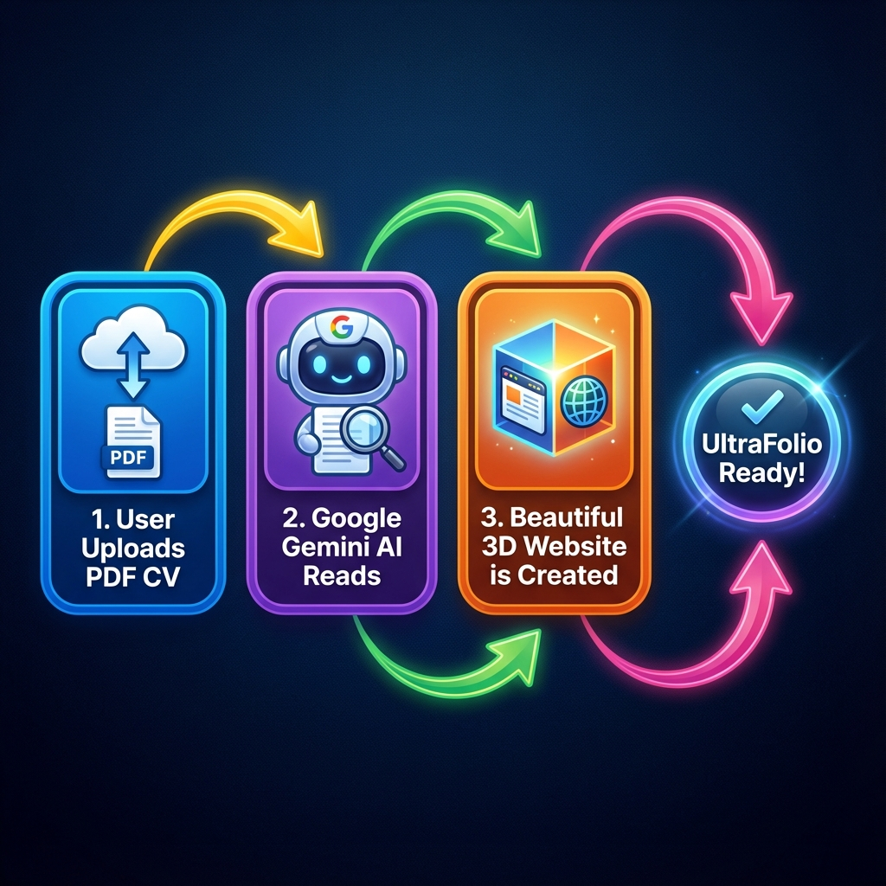

# 🍌 The UltraFolio "Nano Banana" Visual Guide

Welcome to the simplest explanation of your project possible. No complex code, just simple steps.

---

## 📸 1. How It Works (The Flow)

Here is the magic in 3 simple steps:

1.  **User Drop**: A user drops their boring PDF resume.
2.  **Robo-Brain**: Google Gemini (AI) reads it, understands it, and extracts the cool parts.
3.  **Instant Website**: Our engine builds a 3D, responsive website instantly.

---

## 🛠️ 2. What Is It Built With? (The Engine)

We use the "Golden Trio" of modern web dev:

*   **Next.js (The Brain)**: Handles all the pages, routing, and logic.
*   **Supabase (The Memory)**: Stores users, portfolios, and PDF files safely.
*   **Google Gemini (The Design Magic)**: Writes the content and code for the portfolios.

---

## 📂 3. Where Is Everything? (The Map)

If you get lost, just look here:

### 🏠 **Root Folder**
*   `package.json` -> The shopping list (dependencies).
*   `.env.local` -> The secret keys (passwords).

### 📁 **src/ (The Source Code)**
*   `app/` -> **The Pages**. (`/create`, `/dashboard`, `/login`)
*   `components/` -> **The LEGO Blocks**. (Buttons, Navbars, 3D Cards)
*   `lib/` -> **The Tools**. (Helpers for AI, Database, Payments)
*   `templates/` -> **The Designs**. (Modern, Glass, Creative themes)

---

## 🚀 4. How To Fly (Deployment)

1.  **Push to GitHub**: Save your code.
2.  **Vercel Connects**: Vercel sees the change.
3.  **Auto-Ship**: It builds and puts it online automatically.

If you ever see a bug? Check `src/app/api` first—that's usually where the ghosts live.

---

**Made with ❤️ by Antigravity**
